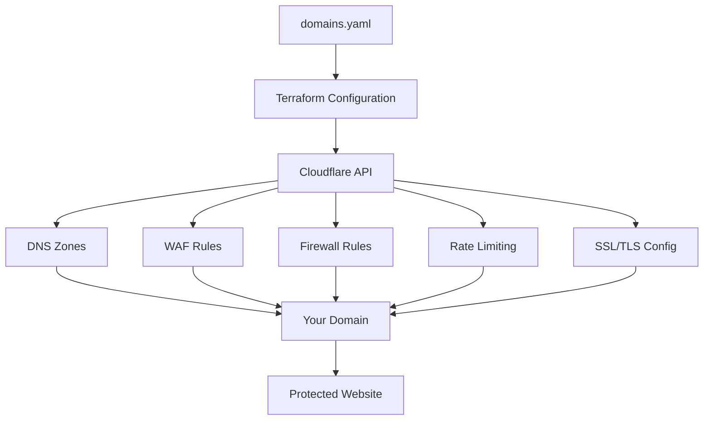

# 🌐 Enterprise-Grade Cloudflare Domain Management with Terraform

This repository provides a **production-ready, security-focused** Terraform configuration for managing multiple domains with Cloudflare. It implements enterprise-grade security features using Cloudflare's free plan, with comprehensive DNS, WAF, firewall rules, and rate limiting through a clean YAML-based configuration.

## 🚀 What This Project Does

**Complete Cloudflare Domain Infrastructure as Code** with:

- 🔒 **Enterprise Security**: WAF, firewall rules, rate limiting, and DDoS protection
- 🌍 **Multi-Domain Management**: Manage unlimited domains from a single configuration
- 🛡️ **Automated Security**: DNSSEC, SSL/TLS strict mode, security headers
- 📝 **YAML Configuration**: Human-readable domain configuration
- 🔧 **Production Ready**: Zero-downtime deployments with state management
- 📊 **Complete Observability**: Detailed outputs and monitoring

## 🔥 Key Features

### Security Features (All Free Plan)
- 🛡️ **Web Application Firewall (WAF)**: OWASP Core Ruleset + Cloudflare Managed Rules
- 🚫 **Advanced Firewall Rules**: Bad bot blocking, SQL injection prevention, path traversal protection
- ⏱️ **Rate Limiting**: Multi-tier rate limiting (general, admin, API endpoints)
- 🔐 **SSL/TLS Security**: Strict mode, TLS 1.3, HSTS headers, minimum TLS 1.2
- 🌐 **DNSSEC**: Automatic enablement for DNS security
- 🔒 **Security Headers**: CSP, HSTS, X-Frame-Options, and more
- 🤖 **Bot Protection**: Verified bot allowlisting with bad bot blocking
- 🌍 **Optional Geo-blocking**: Country-based access control

### Management Features
- 📱 **Page Rules**: HTTP to HTTPS redirects, admin panel protection
- 📝 **DNS Management**: Complete DNS record management with proxy control
- ⚙️ **Zone Settings**: Performance and security optimization
- 🏗️ **Modular Structure**: Clean, maintainable Terraform code
- 📊 **Comprehensive Outputs**: Zone IDs, name servers, security status

## 🎯 Use Cases

### Perfect For:
- **Production websites** requiring enterprise-grade security
- **E-commerce sites** needing DDoS and bot protection  
- **SaaS applications** with API rate limiting needs
- **Corporate websites** with compliance requirements
- **Developer portfolios** wanting professional security
- **Multi-tenant platforms** managing multiple domains

### Security Compliance:
- **PCI DSS** compatible SSL/TLS settings
- **GDPR** privacy protection features
- **OWASP** security best practices
- **NIST** security framework alignment

## 🏗️ Architecture



## 🚀 Quick Start

### 1. Prerequisites

- **Cloudflare Account**: Free account with domains added
- **Terraform**: Version >= 1.0
- **Git**: For version control

### 2. Clone and Setup

```bash
git clone <this-repository>
cd cloudflare-terraform-security
```

### 3. Configure API Access

```bash
# Copy the example configuration
cp terraform.tfvars.example terraform.tfvars

# Edit with your details
nano terraform.tfvars
```

**Required Configuration:**
```hcl
# Get from: https://dash.cloudflare.com/profile/api-tokens
cloudflare_api_token = "your_40_character_api_token"

# Your Cloudflare account email
cloudflare_account_name = "your-email@domain.com"
```

### 4. Configure Your Domain

Edit `domains.yaml` with your domain:

```yaml
domains:
  yourdomain.com:
    plan: "free"
    dns_records:
      - name: "@"
        type: "A" 
        value: "your.server.ip"
        proxied: true
      - name: "www"
        type: "CNAME"
        value: "yourdomain.com"
        proxied: true
    
    # Security features automatically applied!
    # WAF, firewall rules, rate limiting, SSL/TLS, DNSSEC
```

### 5. Deploy

```bash
# Using our Makefile (recommended)
make init
make validate
make plan
make apply

# Or manually
terraform init
terraform plan
terraform apply
```

### 6. Update Name Servers

```bash
# Get your Cloudflare name servers
terraform output name_servers_by_domain

# Update at your domain registrar
```

## 🛡️ Security Configuration

### Automatic Security Features

**Every domain gets enterprise-grade security:**

```yaml
# Automatically configured for all domains:
security_features:
  dnssec: enabled                    # DNS security
  ssl_mode: strict                   # Maximum SSL security
  tls_version: "1.3"                 # Latest TLS
  waf: enabled                       # Web Application Firewall
  ddos_protection: enabled           # DDoS mitigation
  bot_protection: enabled            # Bad bot blocking
  rate_limiting: enabled             # Multi-tier rate limiting
  security_headers: enabled          # HSTS, CSP, etc.
```

### Firewall Rules Applied

1. **Bad Bot Blocking**: Blocks malicious crawlers and scrapers
2. **SQL Injection Protection**: Prevents database attacks  
3. **Path Traversal Prevention**: Blocks directory traversal attempts
4. **Suspicious User Agents**: Blocks known attack tools
5. **Optional Geo-blocking**: Country-based restrictions

### Rate Limiting Tiers

- **General Traffic**: 100 requests/minute per IP
- **Admin Endpoints**: 5 requests/5 minutes per IP  
- **API Endpoints**: 30 requests/minute per IP

## 📁 Project Structure

```
cloudflare-terraform-security/
├── main.tf                    # Core Terraform configuration
├── variables.tf               # Input variables and defaults
├── outputs.tf                 # Output definitions
├── domains.yaml              # Domain configuration
├── terraform.tfvars.example  # Configuration template
├── terraform.tfvars          # Your secrets (gitignored)
├── Makefile                  # Convenient commands
├── get-zone-info.sh          # Zone import helper
├── SECURITY.md               # Security documentation
├── .gitignore                # Security-focused exclusions
└── README.md                 # This file
```

## 🔧 Advanced Configuration

### Custom Security Rules

```yaml
domains:
  yourdomain.com:
    # Override default security settings
    firewall_rules:
      - description: "Block Specific Country"
        expression: '(ip.geoip.country eq "XX")'
        action: "block"
        enabled: true
    
    rate_limit_rules:
      - description: "Custom API Rate Limit"
        expression: 'http.request.uri.path contains "/api/v2/"'
        action: "block"
        period: 60
        requests_per_period: 10
        enabled: true
```

### Environment-Specific Settings

```bash
# Development
cp domains.yaml domains.dev.yaml
export TF_VAR_domains_config_file="domains.dev.yaml"

# Production  
cp domains.yaml domains.prod.yaml
export TF_VAR_domains_config_file="domains.prod.yaml"
```

## 📊 Monitoring and Outputs

### Available Outputs

```bash
# View all security configurations
terraform output security_summary

# Get zone information
terraform output zone_ids
terraform output name_servers_by_domain

# DNS record summary
terraform output dns_records_summary
```

### Security Monitoring

Access detailed security analytics at:
- **Cloudflare Dashboard**: https://dash.cloudflare.com
- **Security Tab**: Real-time threat monitoring
- **Analytics**: Traffic and security metrics
- **Firewall Events**: Rule trigger logs

## 🛠️ Management Commands

### Using Makefile

```bash
make help          # Show available commands
make validate      # Validate configuration
make plan          # Preview changes
make apply         # Deploy changes
make import        # Import existing zones
make format        # Format Terraform files
make clean         # Clean Terraform state
```

### Manual Terraform

```bash
terraform init     # Initialize providers
terraform validate # Validate syntax
terraform plan     # Plan changes
terraform apply    # Apply changes
terraform destroy  # Remove all resources
```

## 🔄 Common Workflows

### Adding a New Domain

1. Add domain to `domains.yaml`
2. Run `make plan` to preview
3. Run `make apply` to deploy
4. Update name servers at registrar

### Updating Security Rules

1. Modify rules in `domains.yaml`
2. Run `make validate`
3. Run `make plan` to see changes
4. Run `make apply` to update

### Emergency Security Response

```bash
# Quickly enable "Under Attack" mode
terraform apply -var="emergency_mode=true"

# Block specific country
# Add to domains.yaml and apply
```

## 🚨 Security Best Practices

### API Token Security
- ✅ Use minimum required permissions
- ✅ Store tokens securely (never commit)
- ✅ Rotate tokens regularly
- ✅ Use separate tokens per environment

### Infrastructure Security
- ✅ Enable remote state storage
- ✅ Use workspace separation
- ✅ Implement approval workflows
- ✅ Monitor security events

### Domain Security
- ✅ Enable DNSSEC on all domains
- ✅ Use strict SSL mode
- ✅ Implement security headers
- ✅ Regular security audits

## 🆘 Troubleshooting

### Common Issues

**Invalid API Token**
```bash
# Check token length (should be 40 characters)
echo "Token length: $(echo $CLOUDFLARE_API_TOKEN | wc -c)"
```

**Zone Import Required**
```bash
# Import existing zone
./get-zone-info.sh yourdomain.com
terraform import cloudflare_zone.domains[\"yourdomain.com\"] ZONE_ID
```

**DNS Propagation**
```bash
# Check DNS propagation
dig @8.8.8.8 yourdomain.com
```

### Debug Mode

```bash
export TF_LOG=DEBUG
terraform apply
```

## 📚 Documentation

- 📖 [Security Features Guide](SECURITY.md)
- 🔧 [Terraform Provider Docs](https://registry.terraform.io/providers/cloudflare/cloudflare/latest/docs)
- 🌐 [Cloudflare API Docs](https://developers.cloudflare.com/api/)

## 🤝 Contributing

1. Fork the repository
2. Create feature branch: `git checkout -b feature/amazing-feature`
3. Commit changes: `git commit -m 'Add amazing feature'`
4. Push to branch: `git push origin feature/amazing-feature`
5. Open a Pull Request

### Development Setup

```bash
# Install dependencies
make setup

# Run tests
make test

# Run security checks
make security-check
```

## 📄 License

This project is licensed under the MIT License - see the [LICENSE](LICENSE) file for details.

## 🙏 Support

- 🐛 **Issues**: [GitHub Issues](https://github.com/your-repo/issues)
- 💬 **Discussions**: [GitHub Discussions](https://github.com/your-repo/discussions)  
- 📧 **Security Issues**: security@yourproject.com

## 🎉 Acknowledgments

- Cloudflare for their excellent API and free security features
- HashiCorp for Terraform
- The open-source community for security best practices

---

**⚡ Ready to secure your domains with enterprise-grade protection?**

Start with `make init` and deploy world-class security in minutes!